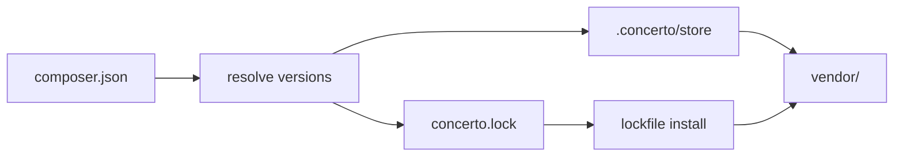
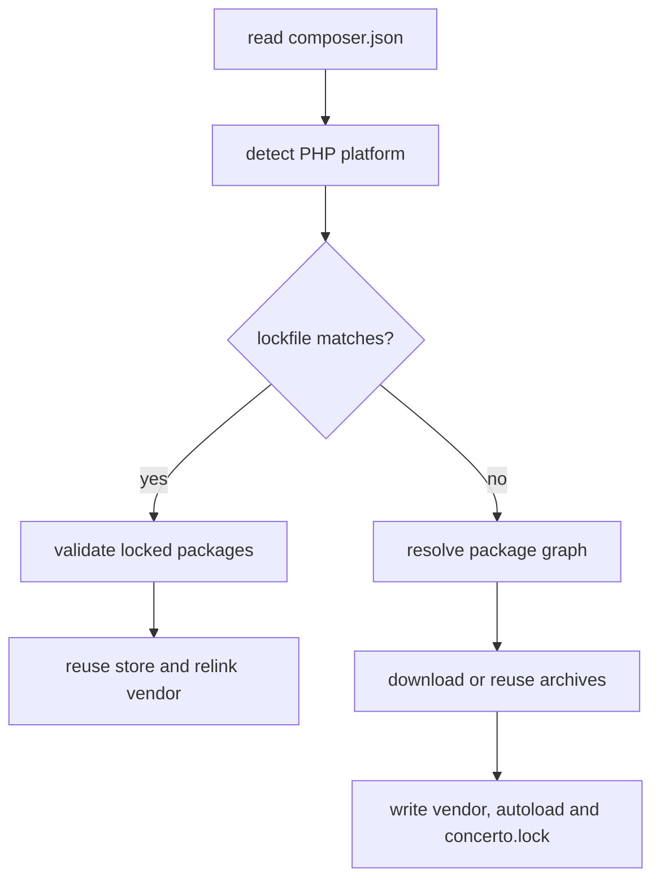

# Concerto

<a href="https://www.rust-lang.org/"><picture><source media="(prefers-color-scheme: dark)" srcset="https://shieldcn.dev/badge/Rust-2024-f74c00.svg?mode=dark"></picture></a>
<a href="https://github.com/TheLifus/concerto/actions/workflows/ci.yml"><picture><source media="(prefers-color-scheme: dark)" srcset="https://shieldcn.dev/github/ci/TheLifus/concerto.svg?workflow=ci.yml&amp;branch=main&amp;mode=dark"></picture></a>
<a href="https://github.com/TheLifus/concerto/actions/workflows/ci.yml"><picture><source media="(prefers-color-scheme: dark)" srcset="https://shieldcn.dev/badge/dynamic/json.svg?url=https%3A%2F%2Fraw.githubusercontent.com%2FTheLifus%2Fconcerto%2Fmain%2F.github%2Fbadges%2Fcoverage.json&amp;query=%24.coverage&amp;label=coverage&amp;mode=dark"></picture></a>
<a href="LICENSE"><picture><source media="(prefers-color-scheme: dark)" srcset="https://shieldcn.dev/badge/license-MIT-2563eb.svg?mode=dark"></picture></a>
<a href="#current-status"><picture><source media="(prefers-color-scheme: dark)" srcset="https://shieldcn.dev/badge/status-experimental-f97316.svg?mode=dark"></picture></a>

Concerto is an experimental Rust package manager for Composer projects.

The goal is simple: keep Composer compatibility as the target, but use a
PNPM-style install model where package sources are stored once per resolved
version and linked into `vendor/`.



Concerto is not a Composer replacement yet. It is usable for testing the
architecture and performance model, while compatibility work is still ongoing.

## Quick start

```bash
cargo build
cargo run -- install
```

Example `composer.json`:

```json
{
  "require": {
    "monolog/monolog": "^3.0",
    "guzzlehttp/guzzle": "^7.0"
  }
}
```

Concerto writes:

```text
.concerto/store/      reusable package sources keyed by package, version, and archive integrity
vendor/               symlinks to stored package sources
vendor/autoload.php   generated autoload entrypoint
concerto.lock         resolved package graph
```

## Current status

Concerto can already install common Packagist packages, resolve transitive
dependencies, write a lockfile, relink from that lockfile, and generate a
minimal Composer-style autoloader.

| Area | Supported today |
| --- | --- |
| Package input | `composer.json` `require`, root platform requirements, `require-dev` by default, `suggest` no-op |
| Registry | `type: composer` repositories using P2 metadata and provider metadata, then Packagist fallback |
| Resolution | PubGrub-backed Composer-like constraints, transitive dependencies, `conflict`, `provide`, `replace`, virtual provider discovery, platform-aware selection |
| Store | local `.concerto/store` with source reuse |
| Install | `vendor/` symlinks, lockfile fast path |
| Platform | `php`, installed `ext-*` with version constraints when PHP reports a version; `lib-*` is reported as unsupported |
| Autoload | `psr-4`, `psr-0`, `files`, `classmap` |
| CLI | `install`, `--help`, `--version` |
| Tests | unit tests, CLI tests, offline install fixtures, ignored E2E benchmarks |

Still out of scope for now:

- installing or displaying `suggest`
- non-`composer` repository types such as `vcs` and `path`
- Composer scripts and plugins, which fail with explicit errors
- global content-addressable store
- full Composer solver parity

## How install works



The lockfile path is the important performance path: when `composer.json`
matches `concerto.lock`, Concerto does not resolve dependencies again. It
validates platform requirements, reuses the package store, relinks `vendor/`,
and regenerates autoload files.

Detected PHP platform data is cached in `.concerto/cache/platform-php.json`.
Concerto keeps separate cache entries for PHP-version-only checks and full
extension metadata, keyed by the resolved PHP binary path and file metadata.

The lockfile format is documented in [docs/lockfile.md](docs/lockfile.md).

`require-dev` is installed by default, matching Composer. Use `install --no-dev`
to install only production requirements from the complete lockfile without
rewriting it.

Use `install --unsafe-trust-store` to relink from an existing store without
verifying stored archives. This can help when archive hashing dominates relink
time, but it skips archive tamper detection and assumes `.concerto/store` is
already trusted.

## Autoload

Concerto generates:

- `vendor/autoload.php`
- `vendor/concerto_autoload.php`

The current autoloader supports `psr-4`, `psr-0`, `files`, and `classmap`.
For `files`, Concerto loads dependency files before dependent package files,
matching Composer's practical ordering requirement for package dependencies.

This is intentionally minimal. Optimized Composer autoload parity is separate
future work.

## Platform checks

Concerto detects the local PHP platform before install:

- `php` uses `php -r 'echo PHP_VERSION;'`
- `ext-*` uses the loaded extension list and `phpversion($extension)` when available
- `lib-*` is recognized but currently fails as unsupported

For deterministic tests and benchmarks, the detected platform can be overridden:

```bash
CONCERTO_PLATFORM_PHP=8.3.0 CONCERTO_PLATFORM_EXTENSIONS=json:1.7.0,mbstring concerto install
```

When a package cannot be installed, errors include the package name, failed
requirement, expected constraint, and detected value.

## Performance

Run the Composer comparison benchmark:

```bash
scripts/bench-composer.sh
```

The script runs Composer and Concerto in Docker so PHP and Composer versions are
stable across machines.

For relink tuning, prefer the local Concerto-only benchmark. It avoids Docker
run overhead and reports median/p95 timings plus perf-event breakdowns:

```bash
scripts/bench-concerto.sh
```

Example output:

```text
Average over 6 cases (11 packages average):
  Cold install: Concerto is 1.5x faster than Composer (1234ms vs 1819ms).
  Lock install: Concerto is 2.8x faster than Composer warm (302ms vs 833ms).
  Vendor relink: Concerto averages 272ms.
  Unsafe trusted relink: Concerto averages 297ms.
```

Read the benchmark as a direction, not a contract. Concerto currently does less
work than Composer, network timings vary, and Docker filesystem costs are part
of the measurement.

## Debug performance logs

```bash
CONCERTO_DEBUG_PERF=1 concerto install
```

Logs are appended to:

```text
.concerto/logs/perf.log
```

Useful events include `resolve_candidates`, `resolve_providers`, `resolve_solver`,
`resolve_package`, `sources_prepare`, `source_download_extract`, `source_reuse`,
`archive_hash_download`, `archive_hash_reuse`, `archive_trust_reuse`,
`vendor_link`, `autoload_write`, `platform_current`, `lockfile_install`, and
`lockfile_write`.

## Project layout

| Path | Purpose |
| --- | --- |
| `src/autoload/` | Composer-style autoload generation |
| `src/composer/` | `composer.json` parsing and package validation |
| `src/error.rs` | typed user-facing errors |
| `src/http/` | HTTP client setup |
| `src/installer/` | install orchestration |
| `src/lockfile/` | lockfile read/write and root matching |
| `src/package_store/` | archive download, extraction, reuse and vendor links |
| `src/packagist/` | Packagist metadata parsing and version selection |
| `src/perf/` | optional performance logs |
| `src/platform/` | PHP and extension checks |
| `src/resolver/` | dependency batches and constraint merging |
| `tests/fixtures/` | offline Packagist and archive fixtures |

Production modules keep implementation in `mod.rs` and colocated unit tests in
`tests.rs`.

## Quality checks

Run before opening a pull request:

```bash
cargo fmt --check
cargo clippy --all-targets --all-features -- -D warnings
cargo test
cargo deny check
git diff --check
```

Offline install tests:

```bash
cargo test --test install_offline
```

Ignored E2E checks:

```bash
cargo test --test cli -- --ignored --test-threads=1
```

## Documentation

- [Contributing](CONTRIBUTING.md)
- [Lockfile format](docs/lockfile.md)
- [Offline test fixtures](tests/fixtures/README.md)

## License

MIT.
