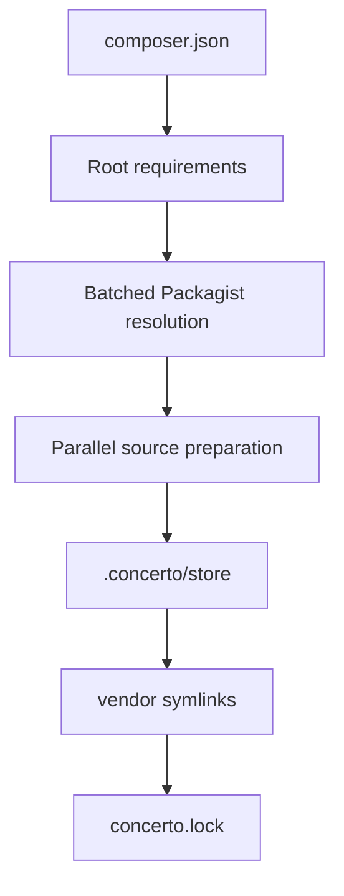
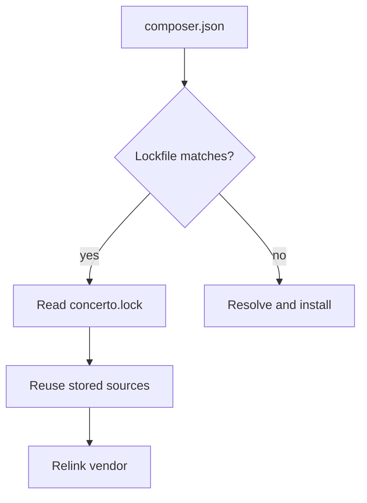

# Concerto

<a href="https://www.rust-lang.org/"><picture><source media="(prefers-color-scheme: dark)" srcset="https://shieldcn.dev/badge/Rust-2024-f74c00.svg?mode=dark"></picture></a>
<a href="https://github.com/TheLifus/concerto/actions/workflows/ci.yml"><picture><source media="(prefers-color-scheme: dark)" srcset="https://shieldcn.dev/github/ci/TheLifus/concerto.svg?workflow=ci.yml&amp;branch=main&amp;mode=dark"></picture></a>
<a href="LICENSE"><picture><source media="(prefers-color-scheme: dark)" srcset="https://shieldcn.dev/badge/license-MIT-2563eb.svg?mode=dark"></picture></a>
<a href="#current-status"><picture><source media="(prefers-color-scheme: dark)" srcset="https://shieldcn.dev/badge/status-experimental-f97316.svg?mode=dark"></picture></a>

> PNPM-inspired package management for Composer projects, written in Rust.

Concerto experiments with a fast install model for PHP dependencies:

- resolve packages from Packagist
- keep extracted sources in a reusable store
- symlink packages into `vendor/`
- generate Composer-style autoload files
- make lockfile installs extremely cheap

It is not production-ready yet.

## Quick Start

```bash
cargo build
cargo run -- install
```

With a `composer.json`:

```json
{
  "require": {
    "monolog/monolog": "^3.0",
    "guzzlehttp/guzzle": "^7.0"
  }
}
```

Concerto creates:

```text
.concerto/store/      # local package store
vendor/               # symlinks to stored package sources
vendor/autoload.php   # generated autoload entrypoint
concerto.lock         # resolved package versions
```

The lockfile format is documented in [docs/lockfile.md](docs/lockfile.md).

## Current Status

| Works today | Not yet |
| --- | --- |
| `composer.json` `require` parsing | platform-aware version selection |
| Packagist metadata fetches | Composer scripts and plugins |
| transitive package resolution | `require-dev` |
| Composer-like version constraints | custom repositories |
| local package store | extension version constraints |
| `vendor/` symlinks | full Composer solver parity |
| `concerto.lock` fast path | global content-addressable store |
| basic platform enforcement | `lib-*` platform checks |
| `psr-4`, `psr-0`, `files`, and `classmap` autoload | optimized Composer autoload parity |
| performance benchmark script | production security hardening |

## Platform support

Concerto validates platform requirements before installing resolved packages.

Supported today:

- `php`: checked against the local `php -r 'echo PHP_VERSION;'`
- `ext-*`: presence checked against extensions listed by `php -m`
- `lib-*`: detected but currently reported as unsupported

If a requirement is not satisfied, install fails with the package name,
requirement name, required constraint, and detected value.

## Install Flow





## Performance

Run the benchmark:

```bash
scripts/bench-composer.sh
```

Sample Docker result:

```text
Average over 6 cases (11 packages average):
  Cold install: Concerto is 1.5x faster than Composer (1030ms vs 1518ms).
  Lock install: Concerto is 2.8x faster than Composer warm (235ms vs 659ms).
  Vendor relink: Concerto averages 255ms.
```

Benchmark caveats:

- Composer and Concerto run in Docker.
- Concerto is built into a bench image based on the same `composer:2` image.
- Composer uses `--ignore-platform-reqs`.
- Concerto currently does less work than Composer.
- Docker startup and mounted-volume filesystem costs are included.
- Network timings vary.

The key signal is the repeated install path: `concerto.lock` plus store reuse
makes rebuilding `vendor/` very cheap.

## Architecture

| Module | Responsibility |
| --- | --- |
| `src/autoload/` | Composer-style autoload generation |
| `src/composer/` | `composer.json` parsing and package validation |
| `src/http/` | HTTP client setup |
| `src/installer/` | install orchestration |
| `src/lockfile/` | `concerto.lock` read/write and root matching |
| `src/package_store/` | archive download, extraction, source reuse, links |
| `src/packagist/` | Packagist metadata parsing and version selection |
| `src/perf/` | optional performance logs |
| `src/platform/` | PHP and extension requirement checks |
| `src/resolver/` | dependency batches and constraint merging |

Modules keep production code in `mod.rs` and unit tests in `tests.rs`.

## Debug Logs

```bash
CONCERTO_DEBUG_PERF=1 concerto install
```

Logs append to:

```text
.concerto/logs/perf.log
```

Useful events:

```text
resolve_package
sources_prepare
source_download_extract
source_reuse
vendor_link
autoload_write
platform_current
lockfile_install
lockfile_write
```

## Quality Gates

```bash
cargo fmt --check
cargo clippy --all-targets --all-features -- -D warnings
cargo test
```

Manual E2E:

```bash
cargo test --test cli -- --ignored --test-threads=1
```

## Roadmap

Production-grade next steps:

- full platform parity, including extension versions and real `lib-*` checks
- optimized Composer autoload parity
- HTTP metadata cache
- local Packagist fixtures for deterministic tests
- CI quality gates
- clearer install errors

Later:

- `require-dev`
- `conflict`, `replace`, `provide`, `suggest`
- custom repositories
- global content-addressable store
- garbage collection
- Composer scripts/plugins strategy
- stronger dependency solver

## License

MIT.

[composer-badge]: https://img.shields.io/badge/Composer-compatible%20goal-885630?logo=composer
[composer-url]: https://getcomposer.org/
